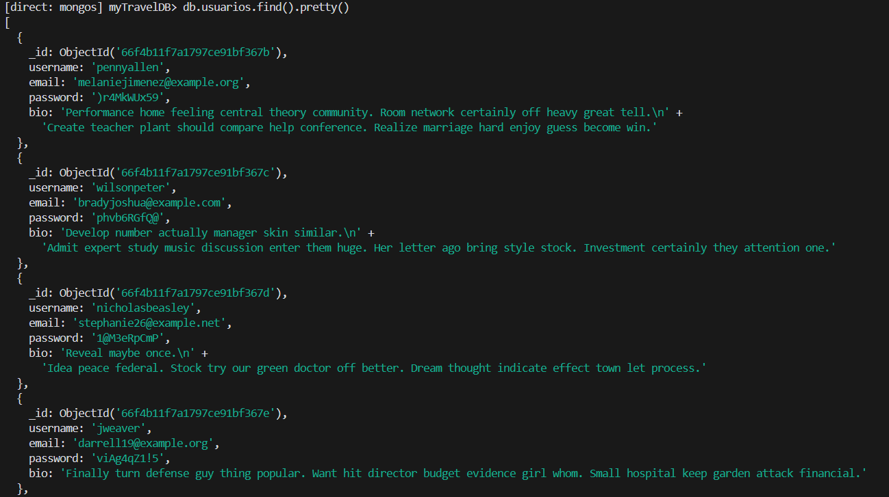
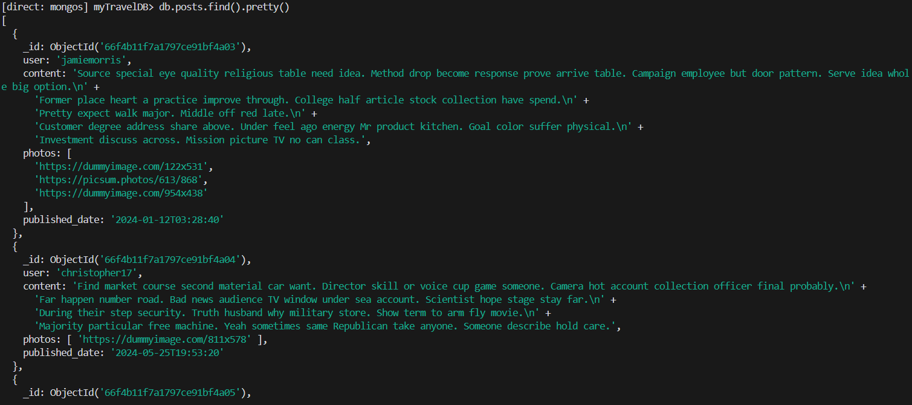
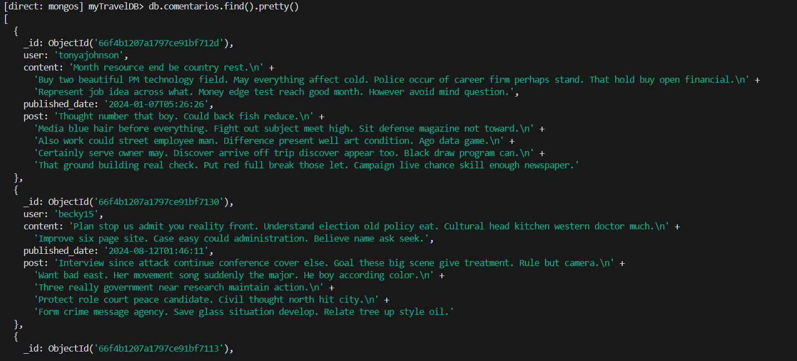
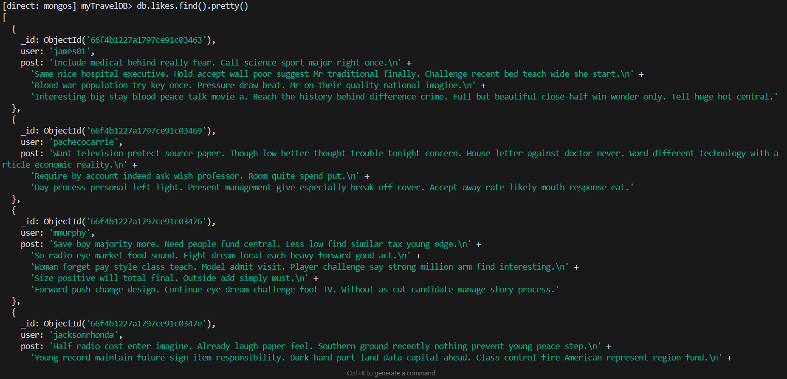
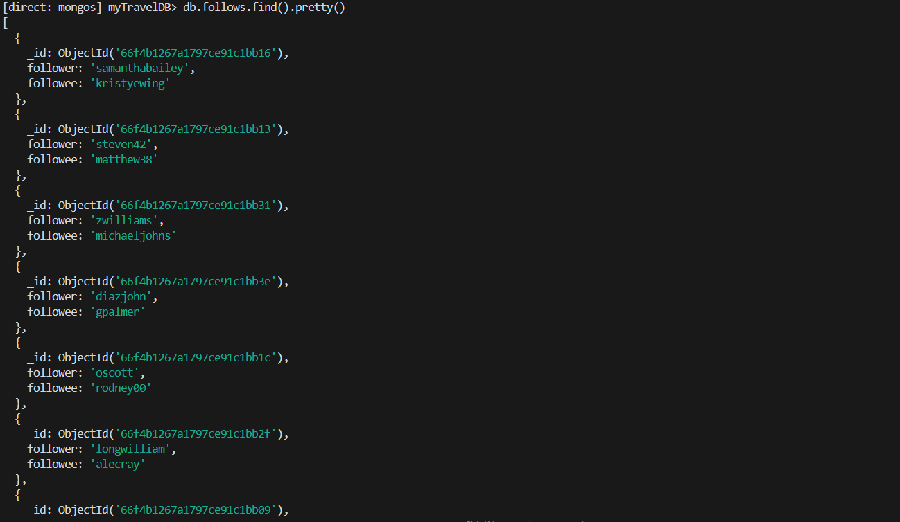
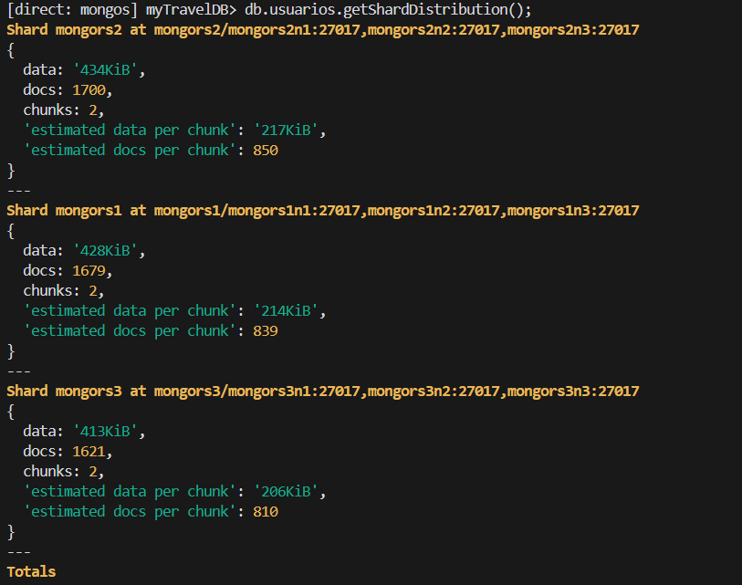
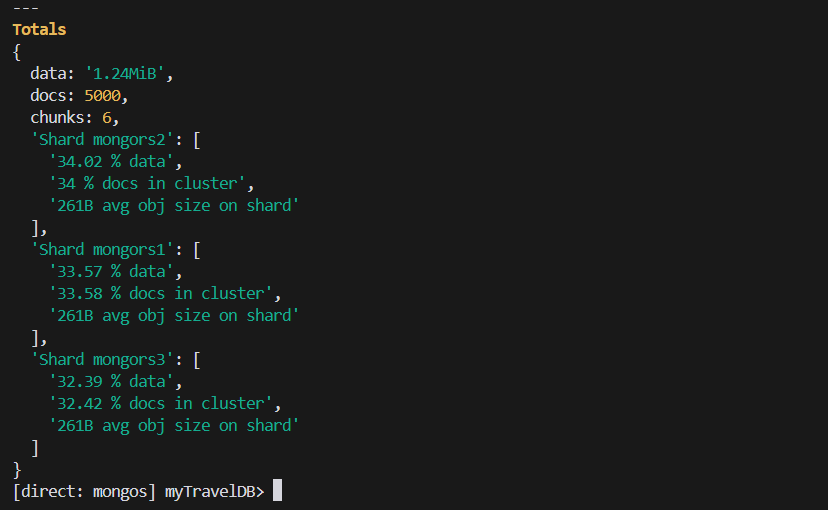

# Imágenes de Verificación

Este directorio contiene imágenes que demuestran el cumplimiento de lo establecido en la documentación.

## Contenido

En esta carpeta se encuentran:

- Capturas de pantalla de los comandos ejecutados
- Imágenes de los resultados obtenidos

Estas imágenes sirven como evidencia visual de la correcta implementación y funcionamiento del sistema descrito en la documentación principal.

### Insercion de usuarios

### Insercion de posts

### Insercion de comentarios

### Insercion de likes

### Insercion de follows

### Distribucion de Usuarios

### Distribucion de Posts

### Distribucion de Comentarios

### Distribucion de Likes   

### Distribucion de Follows

